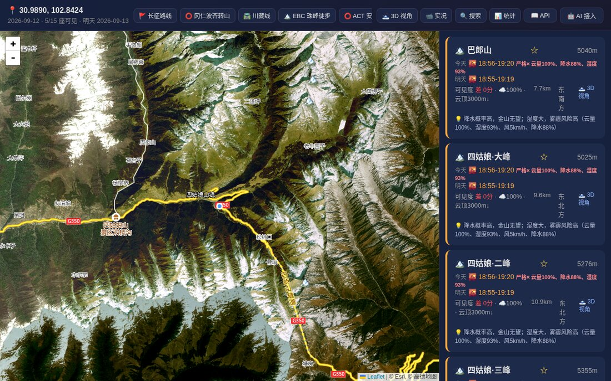

# 看雪山 MCP · Kanxueshan MCP

🏔️ **日照金山（雪山金光）预报的 MCP 服务器** —— 在 Claude、Cursor、Cherry Studio、Claude Desktop 等任何 MCP 客户端里，直接问：

> 「这个周末去子梅垭口，能看到贡嘎山日照金山吗？」
> 「明天在飞来寺，能看到卡瓦格博吗？」
> 「30.9, 102.8 附近有哪些雪山可以看？」

返回：**日出/日落金光时段**、0-100 **可见度评分**、云量/湿度/风速因子，以及观景点建议。



## 直接用（推荐，无需安装）

托管端点（streamable HTTP，免费、无需 API Key）：

```
https://www.yilong.art/mcp
```

**Claude Code / 命令行**

```bash
claude mcp add --transport http kanxueshan https://www.yilong.art/mcp
```

**Cursor**（`~/.cursor/mcp.json`）

```json
{
  "mcpServers": {
    "kanxueshan": { "url": "https://www.yilong.art/mcp" }
  }
}
```

**其他客户端**：在「MCP / 连接器」设置里添加远程 HTTP 服务器，地址填 `https://www.yilong.art/mcp`。
图文接入指引：<https://www.yilong.art/ai.html> ・ 网页版：<https://www.yilong.art>

## 工具（Tools）

| 工具 | 说明 | 参数 |
|---|---|---|
| `search_peak` | 搜索中国雪山及观景点（子梅垭口、飞来寺、猫鼻梁…） | `name` |
| `query_peaks` | 按经纬度查周边可见雪山 + 当日日出/日落金山预报 | `lat`, `lng`, `date?` |
| `forecast_peak` | 某山峰未来 1-7 天预报 | `peak`, `days?`, `viewpoint?`, `date?` |

## 数据与算法

- **气象**：[Open-Meteo](https://open-meteo.com/) 云量（含低云）、降水概率、湿度、风速/阵风
- **地形**：DEM 高程 + 视线分析（判断某观景点能否看到该峰）
- **金光时段**：太阳高度角（Golden Hour）+ 当地时区
- **评分**：综合云量/低云/湿度/风，0-100

覆盖中国主要雪山与观景点（贡嘎山、四姑娘山、卡瓦格博、玉珠峰、慕士塔格……），并提供多语种山峰名检索。

## 自托管（Self-host）

本仓库是 **MCP 接入层**（约 100 行），需要自行准备一份看雪山 API：

```bash
pip install -r requirements.txt
KXS_API=http://127.0.0.1:3000 python3 mcp_server.py   # 默认监听 0.0.0.0:3999
```

环境变量：`KXS_API`（后端地址）· `HOST` / `PORT`（监听，生产建议 `HOST=127.0.0.1` 走反代）·
`KXS_TOOL_LOG`（可选，设为文件路径则每次工具调用追加一行 JSONL：工具名/参数/来源 IP/耗时/成败，便于自建用量统计）·
`KXS_STATS_DB`（可选，设为 SQLite 路径则每次调用在 `toolcall` 表写一行，字段同上，便于直接查询／做面板）。
两个都不设则完全不写盘。

---

## English

**Kanxueshan MCP** — golden-hour sunrise/sunset visibility forecasts for snow mountains in China.

Ask your MCP client: *"Can I see the golden light on Gongga Mountain from Zimei Pass this weekend?"* It returns the golden-hour windows (sunrise/sunset), a 0-100 visibility score, weather factors (cloud cover, humidity, wind), and suggested viewpoints.

Hosted endpoint (no install, no API key):

```
https://www.yilong.art/mcp
```

Tools: `search_peak(name)` · `query_peaks(lat, lng, date?)` · `forecast_peak(peak, days?, viewpoint?, date?)`

Data: Open-Meteo weather + a terrain/viewshed engine (DEM, solar altitude, line-of-sight). Forecast responses are in Chinese; peak names accept both Chinese and English queries.

Web app: <https://www.yilong.art> ・ Setup guide: <https://www.yilong.art/ai.html>

## License

TBD
